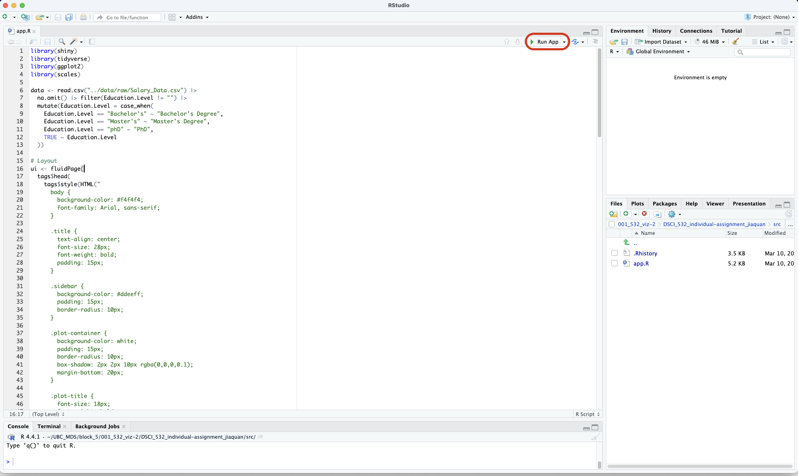

# Motivation

**Target audience:** Job seekers exploring salary trends in the tech industry

Navigating the job market can be challenging, especially when it comes to understanding salary expectations for different roles. This data visualization app helps job seekers explore salary distributions based on job title, age, and gender. By interacting with the app, users can gain insights into monthly salary distribution, compare earnings across different roles, and make informed career decisions. Whether negotiating a job offer or planning a career switch, this tool provides valuable information to help users set realistic expectations and identify high-paying opportunities.

# App Description

https://github.com/user-attachments/assets/b21101f1-a3b9-4bc1-9c29-11d933e1a7a5


# Installation Instructions
If you're interested in running this project on your machine or contributing, follow these steps:

1. Clone the repository

```sh
git clone git@github.ubc.ca:mds-2024-25/DSCI_532_individual-assignment_jiaquan.git
cd DSCI_532_individual-assignment_jiaquan
```

2. Create and activate a Conda environment

Ensure you have Conda installed, then run:
```sh
conda env create -f environment.yml
```

3. Open the `src/app.py` file with RStudio and click on the top right run button to run the app

The app should now be running and a window will pop up in Rstudio.

# Dataset
The dataset used in this project is the "Salary Data" dataset from Kaggle. The dataset contains salary information for different ages, genders and job titles. You can find the dataset [here](https://www.kaggle.com/datasets/mohithsairamreddy/salary-data).
